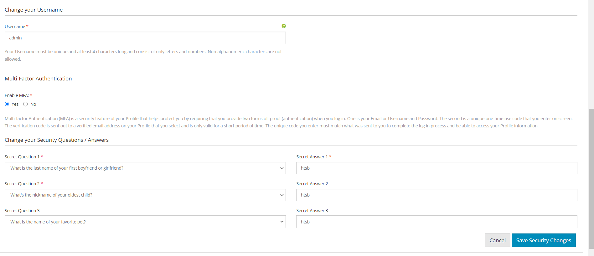

# Multi-Factor Authentication (MFA) Implementation for HTSB Web Application

## Overview

As a Software Engineer Intern for Business Solutions Technology (BST), I worked on enhancing the security of the Hawaii Teachers Standards Board (HTSB) web application by implementing a multi-factor authentication (MFA) system. The project aimed to seamlessly integrate MFA into the existing application without disrupting its functionality and providing flexibility for different user types.

## Introduction

The HTSB web application required enhanced security measures to protect sensitive user data from unauthorized access, especially in the face of potential threats from bad actors. MFA was chosen as a robust security solution that adds an additional layer of protection beyond a traditional username and password authentication method. Throughout the project, I worked in a hybrid methodology that combined aspects of both Waterfall and Agile development processes.

## Technical Implementation

### Technology Used

The following technologies were used in the implementation of the MFA system:

- Frontend:

  - Twig - template engine for PHP
  - HTML - markup language for creating web pages
  - CSS - styling language for web pages
  - JavaScript - client-side scripting language

- Backend:

  - PHP - server-side scripting language
  - Slim Framework - PHP micro-framework for web applications

- Database and ORM:
  - MySQL - database management system
  - PHP Eloquent - ORM for database manipulation

### Work Done

The MFA implementation involved the following steps:

1. **Backend development**: Created new routes and controllers, created new database table for MFA, and modified the existing models to accommodate the MFA functionality.
2. **Frontend development**: Developed user interfaces for MFA setup and validation, integrating it with the existing application design.
3. **Middleware**: Implemented middleware to check MFA validation on every request, preventing unauthorized access by ensuring users have successfully validated their identity through MFA before accessing protected resources.
4. **Testing**: Conducted thorough testing of the MFA functionality in various scenarios to ensure seamless integration with the HTSB web application and adherence to best security practices.

_The MFA prompt screen where users are asked to input the verification code sent to their email._

_The MFA enable screen where users can toggle the MFA functionality on or off._

## Challenges and Learnings

During the course of the internship, I encountered several challenges, such as:

1. **Unfamiliarity with the application codebase and underlying technology**: To address this, I spent time studying and analyzing the existing codebase and familiarizing myself with the technologies used.
2. **Bug discovery and resolution**: Identified and resolved a bug where users could bypass the MFA screen by knowing specific endpoints. The issue was addressed by adding middleware to check MFA validation on every request.
3. **Security assessments**: Conducted thorough security assessments to identify potential vulnerabilities and ensure adherence to best practices for secure MFA implementation.

Throughout the internship, I learned valuable lessons about implementing robust security measures in web applications and gained practical experience working with the technologies and methodologies used in the project.
